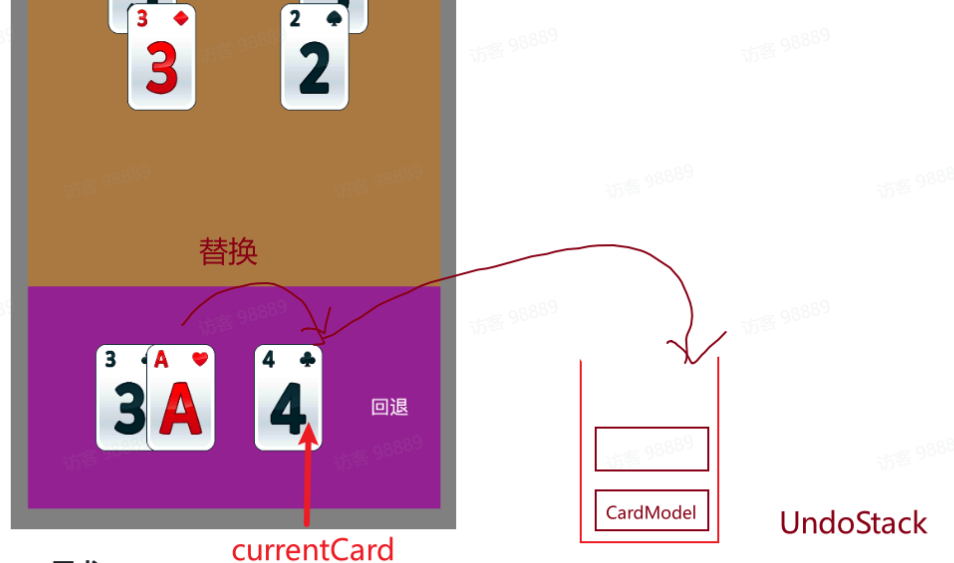

# CardGame

## 演示

<video controls src="演示-1.mp4" title="Title"></video>

---
## 回退功能

> 可回退的前提是UndoStack中有卡片

> 入栈和回退功能都需设置各卡牌数组的剩余数量，以便检查是否胜利
- 替换操作
    - currentCard压入UndoStack栈中
    - 被点击卡牌代替currentCard,并设置下一张卡牌isTouchEnabled为true
~~~c++
    if (cardModel->isTouchEnabled())
    {
        // 入栈
        UndoModel::currentCard->fadeOutAll();
        UndoModel::push(UndoModel::currentCard);
        
        // 失能当前卡牌
        cardModel->setTouchEnabled(false);
        const int idx = cardModel->id.num ;
        if (idx > 0)
        {
            // 使能下一张牌
            StackModel::getCardModel(idx-1)->setTouchEnabled(true);
        }
        // 移动卡牌到currentCard位置
        auto action = cocos2d::MoveTo::create(0.2f, cocos2d::Vec2(700, 250));
        cardModel->runAction(action);
        // 更新剩余卡牌数
        StackModel::residualMinus();
        // 切换currentCard
        UndoModel::currentCard = cardModel;
        CCLOG("ccc:%d size:%d", StackModel::getResidual(), UndoModel::size());
    }
~~~

- 回退
    - currentCard根据卡片坐标属性回到原来位置，并设置为可触摸，设置后一张牌不可触摸
    - UndoStack弹出卡片，并设置为currentCard
~~~c++
if (UndoModel::currentCard->id.area == STACK)
{            

    int idx = UndoModel::currentCard->id.num;
    // 移动当前卡牌回原位置
    auto move = cocos2d::MoveTo::create(0.2f, UndoModel::currentCard->myGetPosition());
    UndoModel::currentCard->runAction(move);
    UndoModel::currentCard->setTouchEnabled(true);
    if (idx > 0)
    {
        // 根据当前卡牌位置失能后一张卡牌
        StackModel::getCardModel(idx - 1)->setTouchEnabled(false);
    }
    
    StackModel::residualAdd();
    card->fadeInAll();
    // 栈顶卡牌回到前卡牌
    UndoModel::currentCard = card;
    
}
else
{
  // PlayField卡牌操作类似 可优化代码量
}

~~~
---

## 关卡存储

使用json数组存储关卡信息：

~~~json
{
    # 关卡数组
    "level":  
    [
        {
            # 待消灭卡牌数组
            
            "Playfield": [
                [
                    {
                        "CardFace": 12,
                        "CardSuit": 0,
                        "Position": {"x": 250, "y": 1000}
                    }
                    。。。
                ]
                。。。
            ],
            # 玩家卡牌数组
            "Stack": [
                {
                    "CardFace": 11,
                    "CardSuit": 0,
                    "Position": {"x": 0, "y": 0}
                }
                。。。
            ]
        }
    ]
}
~~~

将PlayField卡牌分为不同的堆，可大大降低判断卡牌是否可触摸的难度

### 加载逻辑

使用Rapidjson库读取文件

~~~C++
bool LoadLevelFromJson(const std::string& jsonContent, LevelConfig& levelConfig, LevelId levelID)
{
    。。。
    if(document.HasMember("level") && document["level"].IsArray())
    {
        // 解析Playfield
        for(SizeType i = 0; i < playfieldArray.Size(); ++i)
        {
            for(SizeType j = 0; j < rowArray.Size(); ++j)
            {
                // 解析CardFace
                if (cardValue.HasMember("CardFace") && cardValue["CardFace"].IsInt()) 
                // 解析CardSuit
                if (cardValue.HasMember("CardSuit") && cardValue["CardSuit"].IsInt()) 
                // 解析Position
                if (cardValue.HasMember("Position") && cardValue["Position"].IsObject()) 
                levelConfig.PlayFieldCards[i].push_back(card);
            } 
        }
        for(SizeType i = 0; i < stackArray.Size(); ++i)
        {
        
            // 解析CardFace
            if (cardValue.HasMember("CardFace") && cardValue["CardFace"].IsInt()) 
            。。。
            // 解析CardSuit
            if (cardValue.HasMember("CardSuit") && cardValue["CardSuit"].IsInt()) 
            。。。      
            // 解析Position
            if (cardValue.HasMember("Position") && cardValue["Position"].IsObject()) 
                。。。
            levelConfig.StackCards.push_back(card);
        }
    }
    return true;
}

~~~

发现有重复步骤可以优化

如果加入新卡牌属性：
首先更新各枚举，然后再次额外加入if判断
也可以用常量记录属性数量，在此即可从数组中循环读取数据（但要保证属性一一对应）

## 添加新卡牌

新卡牌的图片资源命名风格与其他资源保持一致
将新元素加入数组中，
> 每个元素下标与枚举值一一对应

std::vector<std::string> NumText = { "A", "2", "3", "4", "5", "6", "7", "8", "9", "10", "J", "Q", "K" };

使用字符串格式化路径，无需代码修改
std::string smallRedNumPath = cocos2d::StringUtils::format("res/res/number/small_red_%s.png", NumText[card.face].c_str());

> 新卡牌同样采用本项目的弹栈方式实现回退功能，区别不大。

